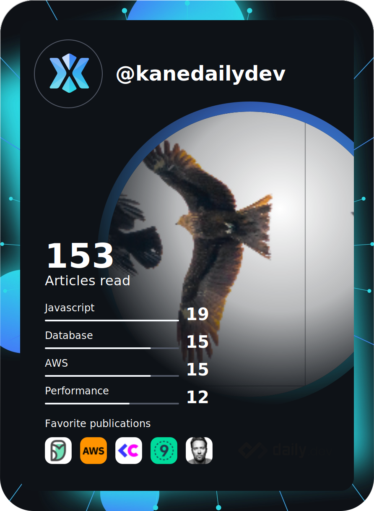

# Hey there! I'm Cuong 👋
<!---

--->

### 👨🏻‍💻 About me
- 🏢   I'm working as a Remote Full-time Backend Engineer for a company providing energy management solutions based in Tokyo - Japan
- 🌱   I’m pursuing to get AWS SAA-C03. I am pleased to share with you what I have followed for learning [AWS SAA-C03](https://github.com/kanelv/AWS-SAA-C02-Course).
- 🌱   I’m improving algorithms knowledge and shaping my coding style daily based on [a good plan shared by a man](https://github.com/kanelv/coding-interview-university/tree/master).
- 🤔 I will try to write my blog about my works and how I enjoy my own life at [here](https://kanelv.github.io/). But now I have nothing... I will be updated soon.
- 📫   How to reach me: cuonglvrepvn@gmail.com

### 🛠 Tech Stack (Languages & Tools)
&nbsp;
&nbsp;
&nbsp;
&nbsp;

&nbsp;
&nbsp;
&nbsp;
&nbsp;
&nbsp;
&nbsp;
&nbsp;
&nbsp;
&nbsp;
&nbsp;

<!--  -->
<!--  -->

<!---
### 🎯 Current Targets
- 🔭 I’m currently working on an exciting project regarding Smart Grid.
- 🌱 I’m currently learning to get AWS SAA-C03. I am pleased to share with you guys what I have followed for learning [AWS SAA-C03](https://github.com/kanelv/AWS-SAA-C02-Course).
- 🌱 I’m improving algorithms knowledge and shaping my coding style daily based on [a good plan shared by a man](https://github.com/kanelv/coding-interview-university/tree/master).
- 🤔 I will try to write my blog about my works and how I enjoy my own life at [here](https://kanelv.github.io/). But now I have nothing... I will be updated soon.
--->
<!---
### 💪 Get Back
Now, I have just completed the M.Eng. I want to come back here to build some of my projects and track myself to learn new things to shape myself personally. That will help me improve myself.
As time goes by, I hope to push more things for myself and contribute to the community.
--->

### ⚙️ GitHub Analytics

 
 

<!--
**kanelv/kanelv** is a ✨ _special_ ✨ repository because its `README.md` (this file) appears on your GitHub profile.

Here are some ideas to get you started:

- 🔭 I’m currently working on ...
- 🌱 I’m currently learning ...
- 👯 I’m looking to collaborate on ...
- 🤔 I’m looking for help with ...
- 💬 Ask me about ...
- 📫 How to reach me: cuonglvrepvn@gmail.com
- 😄 Pronouns: ...
- ⚡ Fun fact: ...
references:
Complete list of github markdown emoji markup
https://gist.github.com/rxaviers/7360908
markdown badges
https://github.com/Ileriayo/markdown-badges
-->
