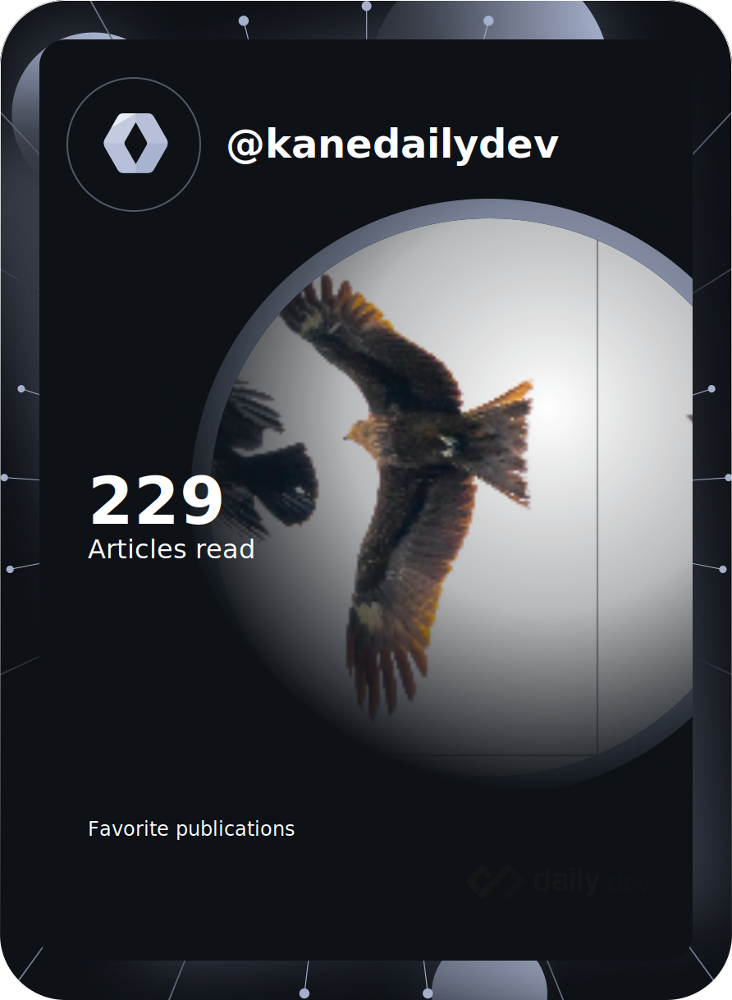

# Nice to meet you 👋

---
### 👨🏻‍💻 About me
- 📫 How to reach me: cuonglvrepvn@gmail.com
<!--  -->

---
### 🛠 Tech Stack

#### 📋 Languages
&nbsp;
&nbsp;
&nbsp;
&nbsp;
&nbsp;
&nbsp;
&nbsp;
&nbsp;

#### 📚 Frameworks, Platforms and Libraries
&nbsp;
&nbsp;
&nbsp;
&nbsp;
)&nbsp;

#### 💾 Databases
&nbsp;
&nbsp;
&nbsp;

#### 🎋 ORM

### 🧪 Testing

#### 🗄️ Cloud Provider, Server, Serverless and Deploy tools

#### 🎛️ Operating System

#### 🕓 Version Control

<!--  -->
<!--  -->
---
### 🗓️ Long time no see
I forgot my GitHub account for a long time to focus on a following things:
- [x] get the M.Eng
- [x] work as a freelance software engineer
- [x] work as an unofficial member of a startup

---
### 🎯 Current Targets
- 🔭 I’m currently working on an interesting project regarding Smart Grid.
- 🌱 I’m currently learning to get AWS SAA-C02. I am pleasure to share with you guys what I have followed for learning [AWS SAA-C02](https://github.com/kanelv/AWS-SAA-C02-Course).
- 🌱 I’m currently improving algorithms knowledge and shaping my coding style day by day following based on [a good plan shared by a man](https://github.com/kanelv/coding-interview-university/tree/master).
- 🤔 I will try to write my blog about my works and how I enjoy my own life at [here](https://kanelv.github.io/). But know I have nothing... I will be updated soon
### 💪 Get Back

Now, I have just completed the M.Eng. I want to come back here to build some of my projects and track myself for learning new things to shape myself personally. That will help me improve myself.

As time goes by, I hope to push more things for myself and contribute to the community.
### ⚙️ GitHub Analytics

 
 

<!--
**kanelv/kanelv** is a ✨ _special_ ✨ repository because its `README.md` (this file) appears on your GitHub profile.

Here are some ideas to get you started:

- 🔭 I’m currently working on ...
- 🌱 I’m currently learning ...
- 👯 I’m looking to collaborate on ...
- 🤔 I’m looking for help with ...
- 💬 Ask me about ...
- 📫 How to reach me: cuonglvrepvn@gmail.com
- 😄 Pronouns: ...
- ⚡ Fun fact: ...
references:
Complete list of github markdown emoji markup
https://gist.github.com/rxaviers/7360908
markdown badges
https://github.com/Ileriayo/markdown-badges
-->
